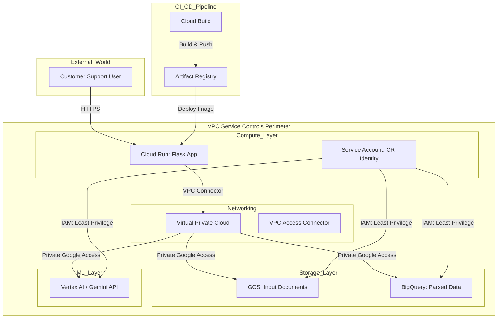

```mermaid
graph TD
    subgraph External_World
        User[Customer Support User]
    end

    subgraph GCP_Project_Perimeter [VPC Service Controls Perimeter]
        subgraph Compute_Layer
            CloudRun[Cloud Run: Flask App]
            SA[Service Account: CR-Identity]
        end

        subgraph Storage_Layer
            GCS[GCS: Input Documents]
            BQ[BigQuery: Parsed Data]
        end

        subgraph ML_Layer
            VertexAI[Vertex AI / Gemini API]
        end

        subgraph Networking
            VPC[Virtual Private Cloud]
            VPCConnector[VPC Access Connector]
        end
    end

    subgraph CI_CD_Pipeline
        CB[Cloud Build]
        AR[Artifact Registry]
    end

    User -->|HTTPS| CloudRun
    CloudRun -->|VPC Connector| VPC
    VPC -->|Private Google Access| GCS
    VPC -->|Private Google Access| BQ
    VPC -->|Private Google Access| VertexAI
    
    CB -->|Build & Push| AR
    AR -->|Deploy Image| CloudRun
    SA -->|IAM: Least Privilege| GCS
    SA -->|IAM: Least Privilege| BQ
    SA -->|IAM: Least Privilege| VertexAI

```