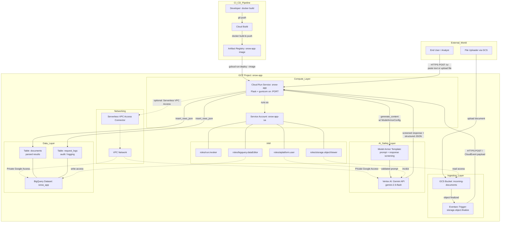

# snow-app Deployment Architecture

```mermaid
graph TD
    subgraph External_World
        User[End User / Analyst]
        Uploader[File Uploader via GCS]
    end

    subgraph CI_CD_Pipeline
        Dev[Developer: docker build]
        CB[Cloud Build]
        AR[Artifact Registry: snow-app image]
    end

    subgraph GCP_Project [GCP Project: snow-app]

        subgraph Compute_Layer
            CloudRun[Cloud Run Service: snow-app<br/>Flask + gunicorn on :PORT]
            SA[Service Account: snow-app-sa]
        end

        subgraph Ingestion_Layer
            GCSBucket[GCS Bucket: incoming-documents]
            Eventarc[Eventarc Trigger:<br/>storage.object.finalize]
        end

        subgraph AI_Safety_Layer
            ModelArmor[Model Armor Template:<br/>prompt + response screening]
            VertexAI[Vertex AI: Gemini API<br/>gemini-2.5-flash]
        end

        subgraph Data_Layer
            BQDataset[BigQuery Dataset: snow_app]
            BQDocs[Table: documents<br/>parsed results]
            BQLogs[Table: request_logs<br/>audit / logging]
        end

        subgraph Networking
            VPC[VPC Network]
            Connector[Serverless VPC Access Connector]
        end

        subgraph IAM
            RoleRun[roles/run.invoker]
            RoleAI[roles/aiplatform.user]
            RoleBQ[roles/bigquery.dataEditor]
            RoleGCS[roles/storage.objectViewer]
        end
    end

    %% --- CI/CD flow ---
    Dev -->|git push| CB
    CB -->|docker build & push| AR
    AR -->|gcloud run deploy --image| CloudRun

    %% --- Ingress paths ---
    User -->|HTTPS POST /ui<br/>paste text or upload file| CloudRun
    Uploader -->|upload document| GCSBucket
    GCSBucket -->|object finalized| Eventarc
    Eventarc -->|HTTPS POST /<br/>CloudEvent payload| CloudRun

    %% --- Runtime identity ---
    CloudRun -. runs as .-> SA
    SA --- RoleRun
    SA --- RoleAI
    SA --- RoleBQ
    SA --- RoleGCS

    %% --- Optional private networking ---
    CloudRun -.->|optional: Serverless VPC Access| Connector
    Connector -.-> VPC
    VPC -.->|Private Google Access| VertexAI
    VPC -.->|Private Google Access| BQDataset

    %% --- Core processing path ---
    CloudRun -->|generate_content<br/>w/ ModelArmorConfig| ModelArmor
    ModelArmor -->|validated prompt| VertexAI
    VertexAI -->|screened response +<br/>structured JSON| CloudRun

    CloudRun -->|insert_rows_json| BQDocs
    CloudRun -->|insert_rows_json| BQLogs
    BQDocs --- BQDataset
    BQLogs --- BQDataset

    RoleGCS -.->|read access| GCSBucket
    RoleBQ -.->|write access| BQDataset
    RoleAI -.->|invoke| VertexAI
```
