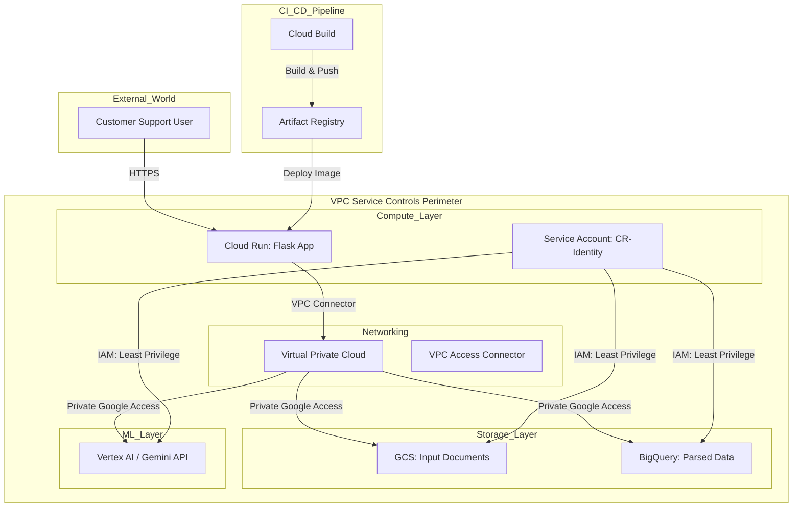

# Challenge 1: AI Security and SensitiveData Protection
Goal: Build a secure Gemini chat app that answers user questions and has access to Google Search.
Do this in a Jupyter notebook or by creating a simple Python app.

Configure Gemini API safety settings, utilize Google Cloud Model Armor to evaluate user inputs for
prompt injections, and apply the Sensitive Data Protection API to scan model outputs for sensitive data
leaks.

Requirements:
- Using the Gemini API, create function that uses Gemini to respond to user queries
- Configure Safety Settings and appropriate instructions
- Configure the Google Search tool
- Bonus: Use Model Armor to moderate user prompts and model responses

# Challenge 2: Code Refactoring with Gemini Code Assist
Goal: In Google Cloud Shell, use Gemini Code Assist, the Gemini CLI, and/or the Antigravity CLI to
analyze brittle legacy regular expression scripts and rewrite them as modern Python functions.

These new functions must use the Gemini API to semantically extract data from unstructured text into structured JSON, while adding automated error handling and generating technical documentation. The extracted data will be logged and saved to BigQuery.

Requirements:
- Rewrite the legacy shell script using Python
- Parse customer service transcripts with the help of the Gemini API
- Write results to BigQuery (Parsed transcript, original transcript, log history)
- Create a simple web-based UI for users

# Challenge 3: Architecting with Gemini Cloud Assist
Goal: Use the Gemini Cloud Assist to architect a secure deployment for your data-extraction program
from the last lab. Prompt Gemini to generate the necessary Terraform code and build a deployment
pipeline to securely deploy the code to Google Cloud.

Ensure the architecture meets the strict data isolation requirements. Create all necessary infrastructure using Terraform and automates scripts.

Requirements:
- Create an architectural diagram that depicts how the application will be deployed
- Write Terraform code for deploying resources
- Automate the deployment

